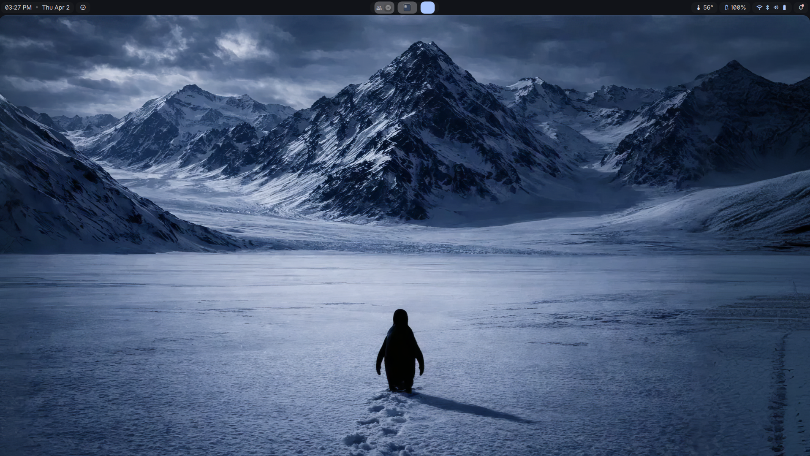
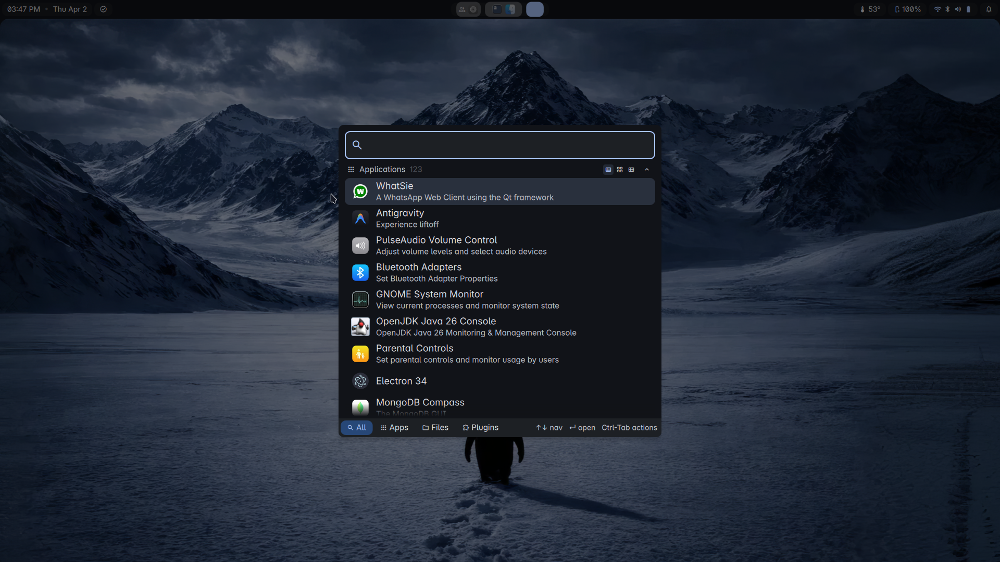
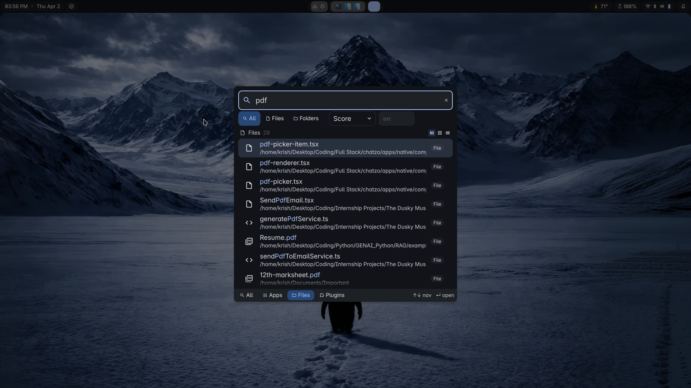
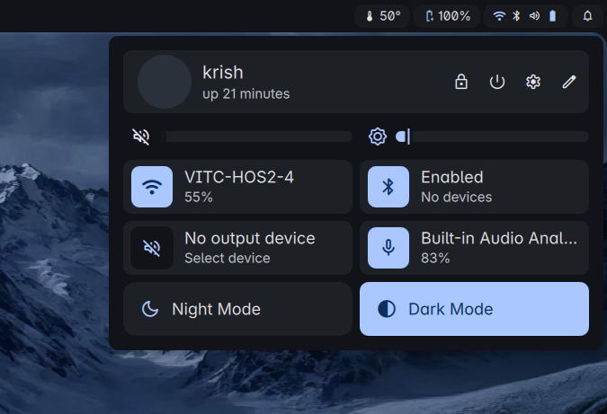
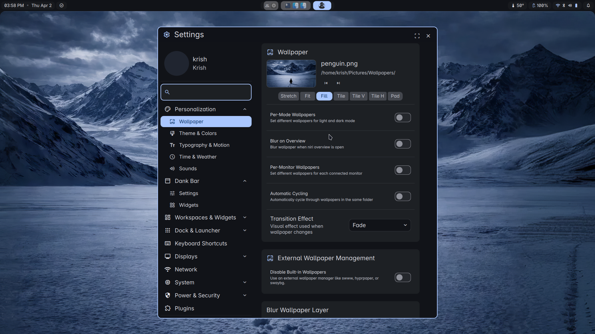
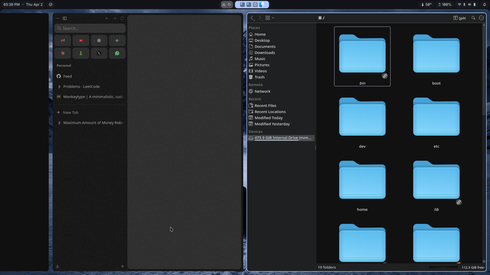
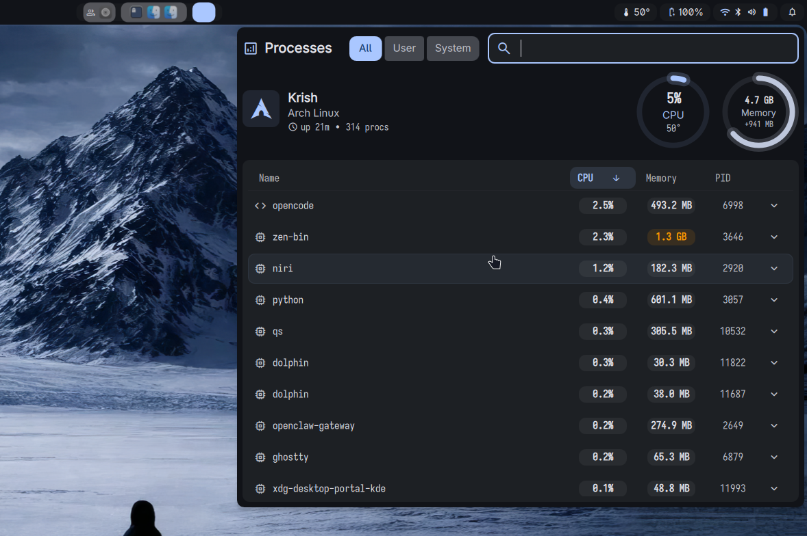
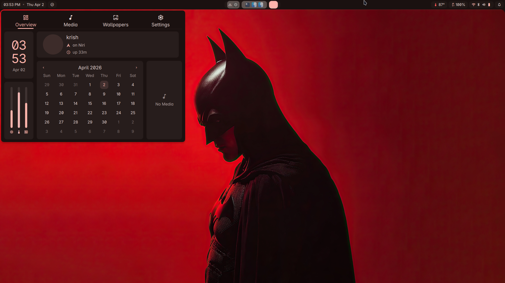
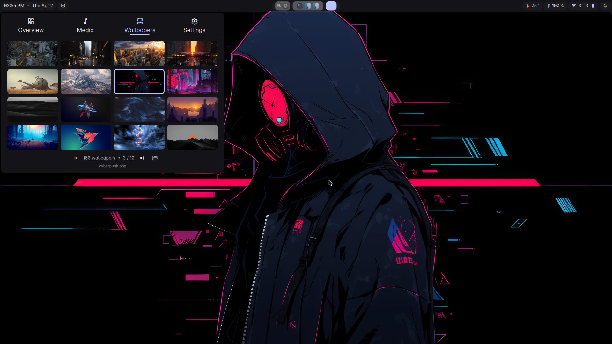
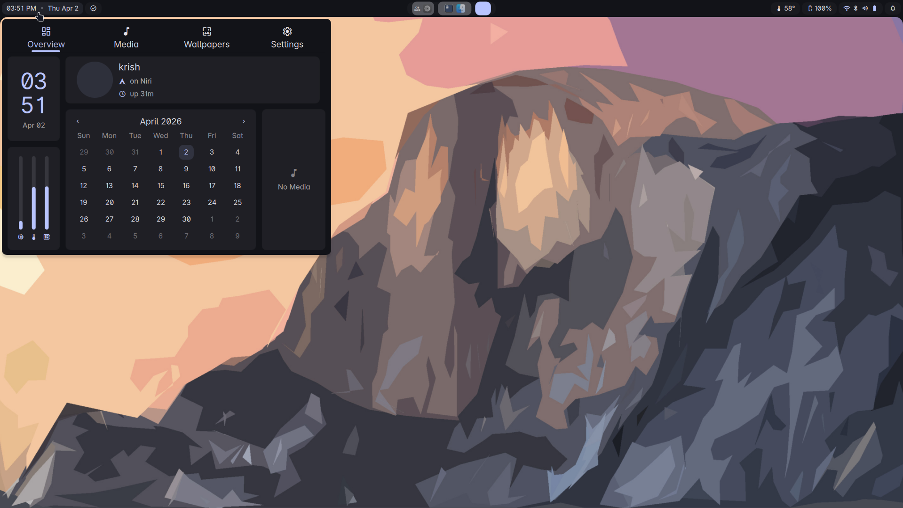

<p align="center">
  
</p>

<p align="center">
  
</p>

## Overview

personal linux dotfiles built around:

- `niri`
- `DankMaterialShell`
- `ghostty`
- `fish` / `zsh`
- `dolphin`
- `btop`
- `Sweet-cursors`
- `Inter` / `Iosevka`
- curated wallpapers
- `dsearch` file search

the repo is curated instead of dumping the whole home directory. the goal is to keep the setup reproducible without shipping a ton of machine junk.

### Search
>
> Launcher search, file search, and quick actions through DMS.

<p align="center">
  
  
</p>

### Shell
>
> DankMaterialShell provides the launcher, controls, running apps, and settings surfaces.

<p align="center">
  
  
</p>

### Compositor
>
> Niri handles the tiled column workflow.

<p align="center">
  
</p>

### Tools
>
> Extra tooling and terminal workflow.

<p align="center">
  
</p>

### Theme Palette
>
> Dynamic colors and shell styling across the setup.

<p align="center">
  
  
</p>
<p align="center">
  
  
</p>

## Installation

### Prerequisites

before running the installer, make sure these already exist on your machine:

- Arch Linux / pacman-based system
- internet access
- a sudo-enabled user
- `curl` only if you want the one-line install path

the setup script bootstraps `git` when it needs to fetch the repo itself, and bootstraps `base-devel` plus `yay` before package installation.
it also enables the core system services for the supported profile, including `NetworkManager`, `bluetooth`, and `sddm`.

### Script Setup

the default install path now targets one supported Arch profile.

optional extras:

- `--with-git-config` installs the repo's `.gitconfig`
- `--with-asus` installs the hardware-specific asus package set

```bash
bash <(curl -fsSL https://raw.githubusercontent.com/krishkalaria12/dots/main/setup.sh)
```

you can also run it from a local clone:

```bash
git clone https://github.com/krishkalaria12/dots ~/dotfiles
cd ~/dotfiles
./setup.sh
```

### Manual Setup

1. clone the repo.

```bash
git clone https://github.com/krishkalaria12/dots ~/dotfiles
cd ~/dotfiles
```

2. install the tracked packages.

```bash
sudo pacman -S --needed $(grep -vE '^[[:space:]]*(#|$)' packages/pacman.txt)
yay -S --needed $(grep -vE '^[[:space:]]*(#|$)' packages/aur.txt)
```

hardware-specific extras live in `packages/optional.txt`.

the installer bootstraps package tooling first, then installs the full profile.
it also sets up system services so the machine can boot into the supported graphical session.

3. run the installer without package installation.

```bash
./setup.sh --skip-packages
```

4. log out and choose the `niri` session.

> [!TIP]
> A curated wallpaper pack is included in `assets/wallpapers/` if you want the same base set.

> [!NOTE]
> The installer creates backups in `~/.local/state/dots-backups` before replacing matching files.

## Structure

```text
.
├── assets
│   ├── fonts
│   ├── icons
│   └── wallpapers
├── config
│   ├── btop
│   ├── DankMaterialShell
│   ├── dolphinrc
│   ├── fish
│   ├── ghostty
│   ├── kdeglobals
│   ├── niri
│   ├── qt5ct
│   └── qt6ct
├── home
│   ├── .gitconfig
│   ├── .profile
│   └── .zshrc
├── local
│   └── bin
│       ├── brightness
│       └── niri-screenshot-select.sh
├── packages
│   ├── aur.txt
│   ├── optional.txt
│   └── pacman.txt
├── screenshots
├── services
│   └── user
│       ├── dms.service
│       └── dsearch.service
└── setup.sh
```

## Notes

- this is a curated repo, not a raw backup of `~/.config`
- machine junk, caches, and generated state stay out unless they are intentionally part of the setup
- `dsearch` config is generated per-user during setup because indexed paths depend on the local machine
- the wallpaper folder is a curated subset, not the full personal wallpaper collection
